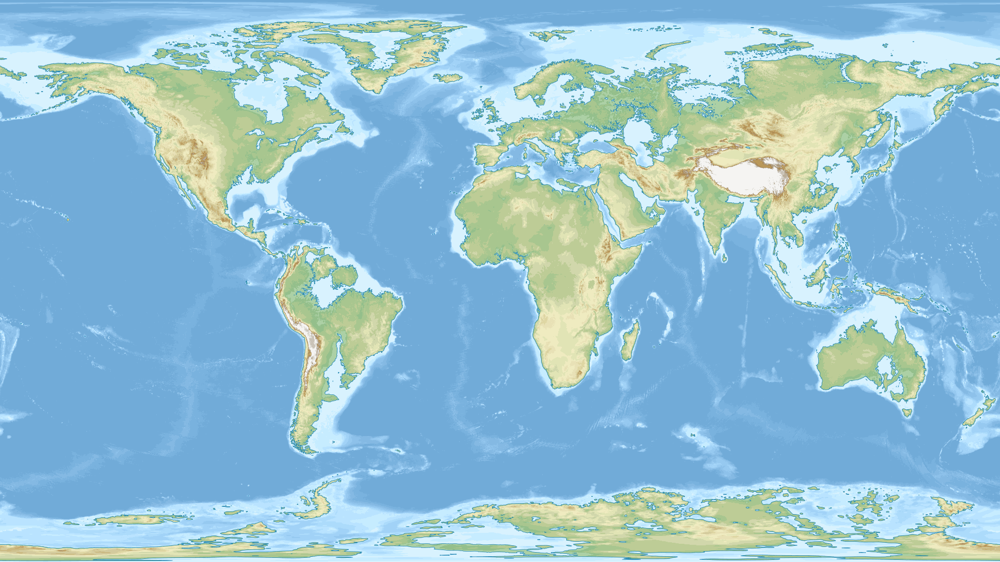
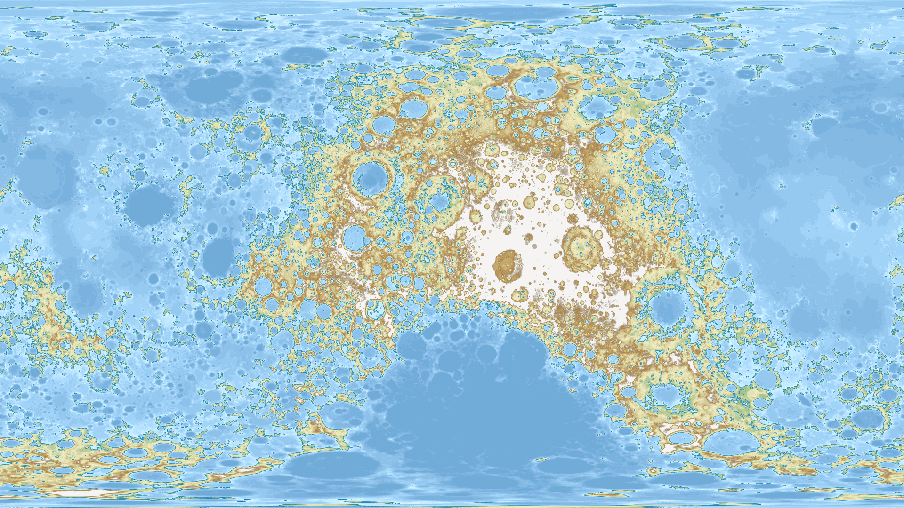
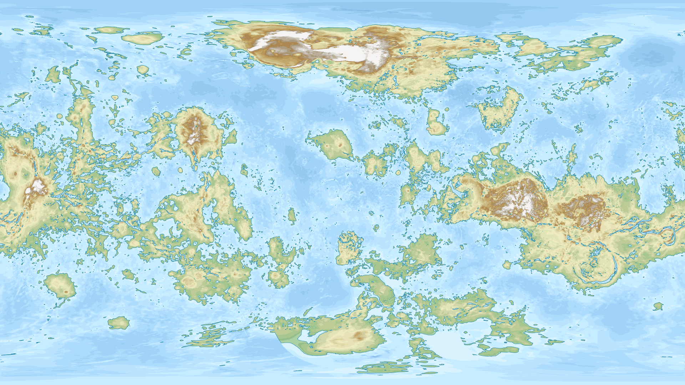
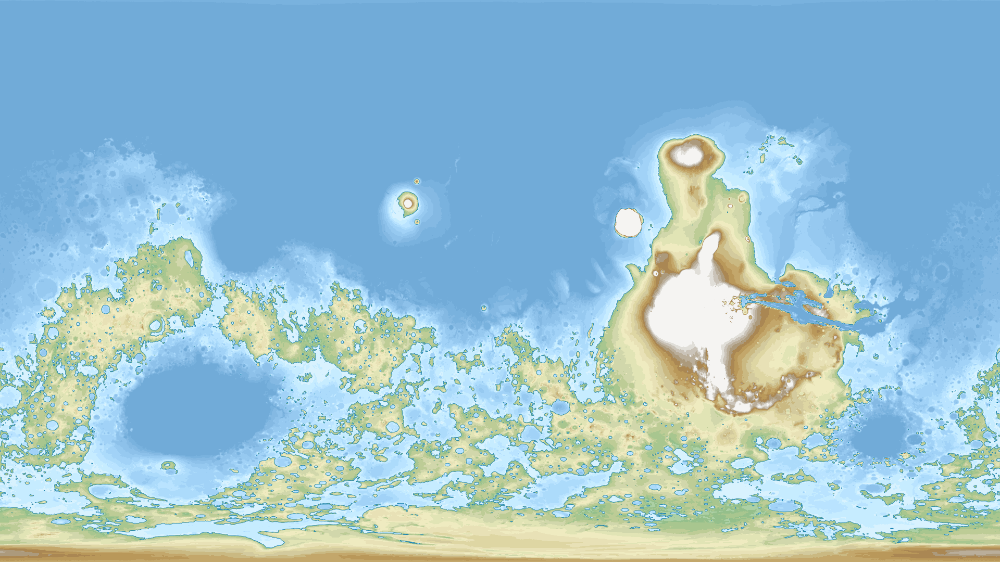
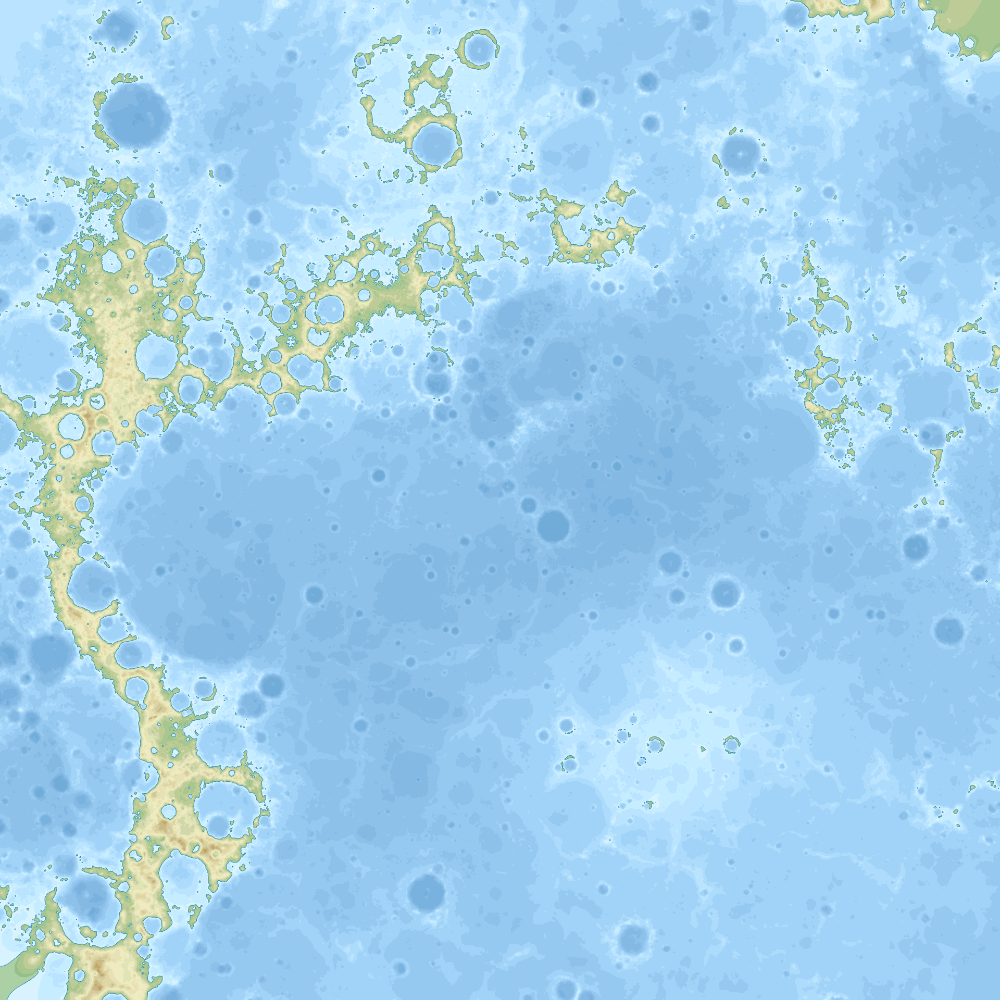
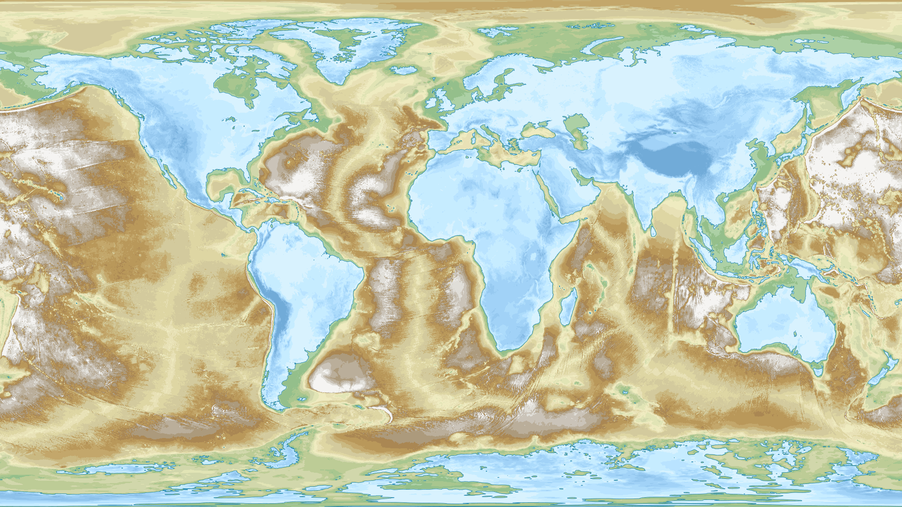
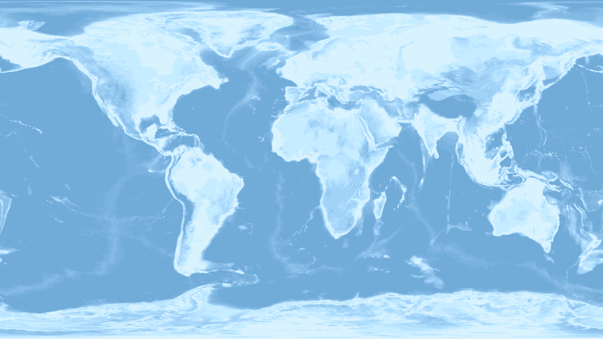
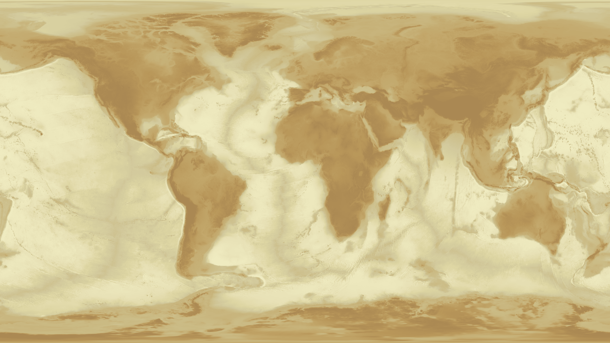

# Watering and draining the Earth, and other celestial objects

What the Earth would look like if the sea level suddenly changed?
And what would be the Moon, Mars and Venus with as much water as on the Earth?

This code outputs maps from topographic data of planets, where the color palette 
is defined such as the highest altitudes look like mountains (white or brown),
the intermediate altitudes like plains (green), and the lowest like water 
(blue or deep blue).

You can check out the related blog post here: https://ahstat.github.io/Topography/
or directly see images in the `outputs` folder.

On the blog post, I also explain how to collect and pre-process data before
applying this code.

**Some outputs**

*World with 100m increase of the sea level*
 

*The Moon with about 70% of the surface covered by water*
 

*Venus with about 70% of the surface covered by water*
 

*Mars with about 70% of the surface covered by water*
 

*Mercury above 55th parallel north* (the center of the map is the North Pole)
 

*A reversed world*
 

*Subworld*

*Sandy world*

